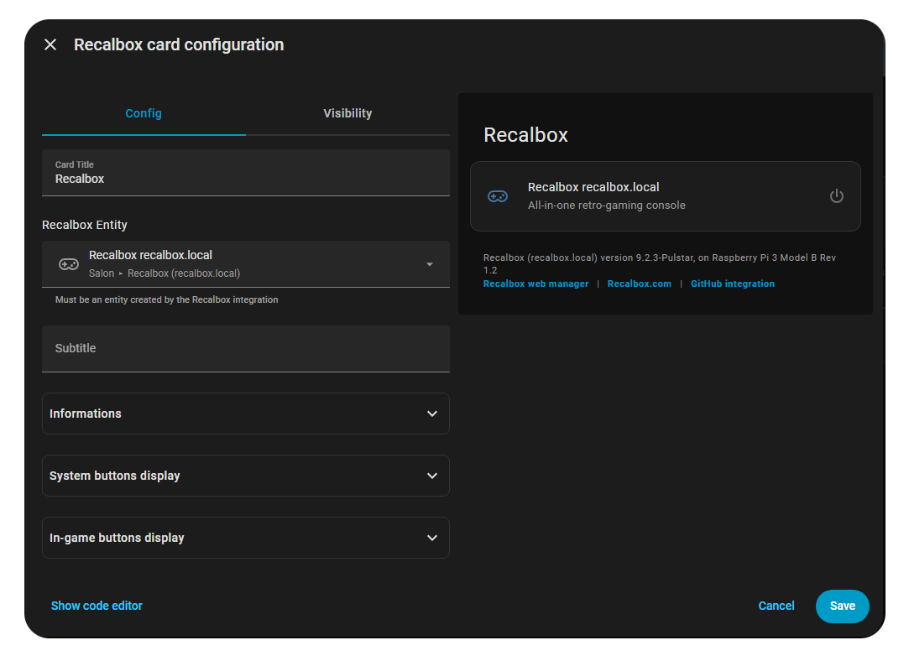

# Recalbox Home Assistant integration - Changelog

> By Aurélien Tomassini, 2026.

## v1.5.1 - 

- If multiple Recalbox entities are matching to the same Recabox (example, one is "recalbox.local" and one is "192.168.1.X", both for the same device)
  we now update each matching instances, instead of only the first one.
- Add new button/service to quit Kodi. Can then be quit clicking in Recalbox Card, in the Home Assistant services, or by text/voice in Assist.

## v1.5.0 - 04/02/2026 - (Breaking changes) Remove MQTT usage

> Major changes : to make installation way more easy, I left MQTT broker dependency !  
> Now the integration exposes an API, and the Recalbox sends its data to Home Assistant via this API.  
> The installation is only 2 steps now :
> - copy the script on Recalbox
> - install the HACS github project
> - nothing else
> 
> Please upload the new Recalbox script to Recalbox `userscripts` folder.

- Remove MQTT dependency, for a lighter architecture : Recalbox now sends its data to an API instead of MQTT.
  The installation is now way easier for customers : no MQTT broker to install, no user, nothing.
- On receiving data, while last Ping was failed, forces an instant Ping to switch the Recalbox entity status ON
- Between Home Assitant restarts, restore the previous Recalbox important informations (hardware, recalboxVersion, scriptVersion)
- On Home Assistant (re)start, request via API the Recalbox Status to get the current game
- Force using IPv4 in Recalbox hostname resolution to make communication more stable

## v1.4.1 - 03/02/2026

- Ensure git pulls the sources with `LF` instead of `CRLF` on windows (+ add troubleshot section in readme)
- Add ℹ️ button in the Recalbox Card, going to the quick intro page https://ooree23.github.io/RecalboxHomeAssistant/
- If only one instance of Recalbox exists, then it considers every message is for himself, no matter the IP address
  where the message comes from.

## v1.4.0 - 01/02/2026 - (Breaking changes) Support multiple Recalbox !

> This version is the first version to fully support mutiple instances of Recalboxs in the same local network !  
> Thanks to mDNS, in Home Assistant we try to get Recalbox IP. When a MQTT message arrives from Recalbox,
> it now contains the Recalbox IP address (from itself), we can then check, when receiving it, to which instance
> it was sent to.
> 
> The Recalbox script has changes and needs to be updated.  
> If the script version in < 1.4.0, please upgrade !
> (a message will be displayed in the Recalbox card).

- Clean `recalboxIpAddress` and `scriptVersion` switch attributes
- In the HA model, return to 'None' fields values, instead of "-" that was not consistent
- [Support multiple Recalbox](https://github.com/ooree23/RecalboxHomeAssistant/issues/1)
  - Simplify MQTT messages : a single message from Recalbox to Home Assistant contains status + game attributes, instead of 2 messages before
  - On message received, checks the IP address of each Recalbox host, to check if the message comes from this Recalbox
- Display a message if the script installed on Recalbox needs to be upgraded

## v1.3.1 - 01/02/2026

> This version adds Assist auto reload on updated Assist sentences.

- On first install or updates, if custom sentences have been updated,
  tries to reload Home Assistant Assist sentences without asking for a new restart.  
  Only if fails to reload, it will ask the user to restart.
- Reorder settings buttons, because save/load were not in the same order that in the card
- Change JSON sent from Recalbox to Home Assistant, from `imageUrl` to `imagePath`.
  Home Assistant will recompose the full URL on his own, because he knowns the host+port of this Recalbox.
  Integration is still compatible with older versions, it reads `imageUrl` is existing in JSON, else it composes itself the URL with `imagePath`.
- Duplicate Recalbox script in two versions (only one required) :
  - `Recalbox/userscripts/home_assistant_notifier.sh`:
    - Improve to get Home Assistant IP adress only if the event is useful
    - Optimization : as soon as the Home Assistant IP is solved, it is saved in cache to make next executions quicker
    - Add `shutdown` and `reboot` events in Recalbox script, to say to Home Assistant that the Recalbox is turning off (was only listing `stop` until that)
  - `Recalbox/userscripts/home_assistant_notifier(permanent).sh` **EXPERIMENTAL** :
    - New version, that is permanent : the script is launched only once, and loops on events.
    - It should be way more optimized, and waits to be connected to network to send MQTT messages.
    - Create a timestamped logs file : `/recalbox/share/system/logs/home_assistant_integration/*`
- Both scripts now send their version to Home Assistant, in the JSON message, 
  `"scriptVersion": "home_assistant_notifier.sh:v1.3.1"` or `"scriptVersion": "home_assistant_notifier(permanent).sh:v1.3.1"`
- Auto clean scripts logs
- Persist `scriptVersion` as Recalbox extra state attribute
- Added `host` attribute, so the REcalbox card uses the configured host to access webmanager, instead of `ip_adress` that doesn't exist yet
- Added `recalboxIpAddress` attribute, instead of setting as the host
- When Home Assistant (re)starts, pings the Recalbox to directly set as ON (without game info) or OFF, instead of waiting for the first ON MQQT message
- Change Recalbox Card chip color in light theme.

## v1.3.0 - 29/01/2026 - Recalbox card visual editor 

- Implements a visual editor for Recalbox Card on dashboard.  
  Instead of having a yaml file to fill, the default card editor has now a UI to
  edit the options you want, with live preview.
- Translations of visual editor in English and French
  

## v1.2.8 - 28/01/2026

- Rename `udp_emulstation` to `udp_retroarch` in sources and translations
- Improve Recalbox card layout (especially current game buttons)
- Add "lang" hidden fields to change the lang of the Recalbox card (useful in dev)
- Update documents screenshots

## v1.2.7 - 28/01/2026

> This version adds many options to the Recalbox dashboard card,
> and new features to load/save your current game state.

**Recalbox Card settings**
- When adding Recalbox card to dashboard, pre-fill the yaml required structure (type, entity, title)
- Add Recalbox Card options to display or not each buttons
- Add Recalbox Card option to display Rom path (false by default)
- Group current game action buttons in a single box, to avoid having too many buttons

**Save/load game state**
- Add entity save/load features
- Expose services to Home Assistant
- Add new buttons (more condensed now) to access those features from dashboard card
- Add new Assist intents to access save/load game state

## v1.2.6 - 28/01/2026

- Add translated labels for creation/modification of Recalbox Config
- Move ports configuration to an advanced section
- Rename API ports fields to be more convenient (entities impacted)
- Clean Recalbox entity attributes
- Add a ping (optionnal) test on Recalbox creation

## v1.2.5 - 28/01/2026

- Rename `api_port_webmanager` configuration attribute
- Use `api_port_webmanager` in the web manager link in dashboard Recalbox Card
- Fix device `configuration_url`

## v1.2.4 - 28/01/2026

> This version allows you to defined custom host + ports for Recalbox,
> And also to modify it later if needed.

- Add IP address/Host of the Recalbox as an attribute. 
  So it will be available to display in the entity, or to use in scripts / automations.
- Add IP Address/Host and ports as a Diagnostic entity, to be more visible in the device page
- Improve device infos box
- [#2](https://github.com/ooree23/RecalboxHomeAssistant/issues/2) and [#3](https://github.com/ooree23/RecalboxHomeAssistant/issues/3) :
  Add settings to let the user choose different host, and ports for API and UDP, if he configured different ones on Recalbox.
  User can change later the host and ports of the device, it will update the entities.

## v1.2.3 - 26/01/2026

- Update docs and code, because I changed my Github username to `ooree23`.

## v1.2.2 - 26/01/2026

- Implementing a new coordinator with Pings history.
  If the Recalbox didnt answer to all the pings during the last 2 minutes,
  then we consider it's offline. If there is at least one ping OK during the
  the last 2 minutes, then we use the status based on MQTT messages.
- Improve MQTT logs
- Reset the games attributes when the Recalbox turns offline,
  to avoid displaying old data when it restarts

## v1.2.1 - 26/01/2026

- In the dashboard card, remove the interactive switch, to a simple power state icon
- Add an exception when trying to turn on Recalbox from HA (only turn off is supported)
- Externalize the custom_sentences installer to be an sync job
- Externalize Recalbox services installation
- Improve code and logs on assist sentences and intents registration
- For Voice/Text assis, now looks for the Recalbox that are ON, instead of using the 1st one by default.
  Preparing also commands to specify a Recalbox target by name.
- Improve french pausing/resuming sentences

## v1.2.0 - 26/01/2026 Breaking change

> This versions changes the entity from `binary sensor` to `switch`.
> If you installed the previous version, you will need to remove the
> existing binary sensor entity, and use the `switch` in your dashboard
> entity field, and your automations.

- Transforms the binary sensor to a switch entity
- Improve custom_sentences update check algorithm, 
  in order to not ask to reboot if the sentences have no real change
- Improve french custom sentences for intents (more natural)
- Improve dashboard layout and texts
- Remove buttons entities, now using services to avoid Recalbox instance confusion
- User can change the card title with `title` card attribute
- The Recalbox name (inside card) is now friendly name, or entity name, or "Recalbox".
  It allows to know which name should be said to Assist to trun off the switch

## v1.1.0 - 25/01/2026

- Improve documentation
- Improve dashboard translations
- Add description translation of the Custom Card "Recalbox Card" selector, based on the browser language

## v1.0.3 - 25/01/2026

- Reduce ping rate from 60s to 30s, to detect Recalbox disappearing or reappearing.
  To be displayed as ON, the recalbox must received pings AND send ON status via MQTT messages.
  If one of those conditions is false, the recalbox will be shown as OFF.
- Add conversation/assist translations in FR/EN.
  It is based on the assist language.
- Made a pull request to add Recalbox icon in the integration : https://github.com/home-assistant/brands/pull/9269

## v1.0.2 - 25/01/2026

- Fix en/fr empty json files

## v1.0.1 - 25/01/2026

- Add a coordinator, which pings the Recalbox every 1min, to check if it is still ON
- Add HACS integration button in the Github page
- Improve logs
- Internationalisation FR/EN of the Dashboard card
- Set "Recalbox" notification channel on automation example
- Remove screenshot button when Kodi is running

## v1.0.0 - 25/01/2026 - First stable version

- Add a quit current game button, when a game is running

## v0.2.1 - 25/01/2026

- Compare MD5 of sentences files, in order to update them only when required.
  It avoids to show double restart required when the update doesn't change the sentences.

## v0.2.0 - 24/01/2026

- As `extra_folders` is not working, added a script to copy the `custom_components/recalbox/custom_sentences`
  to `custom_sentences`. As this script is launched when the integration starts, you could need two restarts
  to get Assist sentences : a first restart to run the integration, that will copy the sentences ; and a second
  restart, that will read the sentences on start.
- Display in dashboard if the secondary restart is needed.
  The alert is shown when the sentences have been changed.
- Fill the default host when creating your Recalbox, with `recalbox.local`
- Move recalbox entities to "instances" in order to be able to store other "global" variables, like "needs_restart"
  to show info in the dashboard.

 
## v0.1.2 - 24/01/2026

- Try to force HACS to copy `custom_sentences` folder, thanks to `extra_folders` key
- Improve dashboard card actions CSS to make bottom smooth

## v0.1.1 - 24/01/2026

- Deep modification to move recalbox actions in the entity, making buttons and intents only proxies
- Fix shut down with the button, to force and keep status OFF
- If an image path exists, but not the image, do not display the broken image

## v0.1.0 - 24/01/2026

- Changes from Yaml version to Python custom integration
- New screenshot script : it first tries a UDP screenshot.
  If it fails, then it tries a screenshot via API.  
  Used both for voice/text command, and button pressed.
- Update dashboard card and button icons
- Improve notify automation example, to avoid wrong notification when Home Assistant updates itself while Recalbox is still off.
- When looking for game name in game launch, remove accents
- Create HACS files to enable repo download via HACS

## v0.0.2 - 20/01/2026

- Update the example dashboard template, to use the device information to display it at the bottom of the Recalbox column
- Moved variables to be changed on top of the `recalbox.yaml` file. The version and hardware are not hardcoded anymore.
- Adds web links to recalbox web manager, and to this repository to get updates
- Try to search for a game even if the recalbox is not seen connected
- Add `recalboxVersion` and `hardware` in the MQTT message sent to Home Assistant. So HA can know the OS version and device of Recalbox.
- Update the recalbox_card example with actual Recabox version and hardware
- Recalbox now sends messages to MQTT in retain mode for the attributes (and then remember the recabox version and hardware)
- Add 2 sensors sensor.recalbox_hardware and sensor.recalbox_firmware_version to persist values
- Add screen shot button
- Add screen shot action via assist (text or voice)
- Launch game from text/voice command, searching for the ROM in the wanted system, and launch command via UDP

## v0.0.1 - 13/01/2026

> First integration

- Hardcoded device as a Recalbox 9.2.3 on Raspberry Pi 3 (no effect, only for display). It can be changed with the yaml
- Script on Recalbox side to notify the Home Assistant of any event, and compute the game image URL
- Home Assistant package configuration complete for receiving Recalbox events, actions to turn off or reboot the recabox, dashboard template, voice/text actions to :
    - know the status of Recalbox (on/off)
    - know the currently played game
    - try to launch a game (not yet working, for know it can search if the file exists, but there is no API to laucnhe the game, and no SSH implementation done yet)