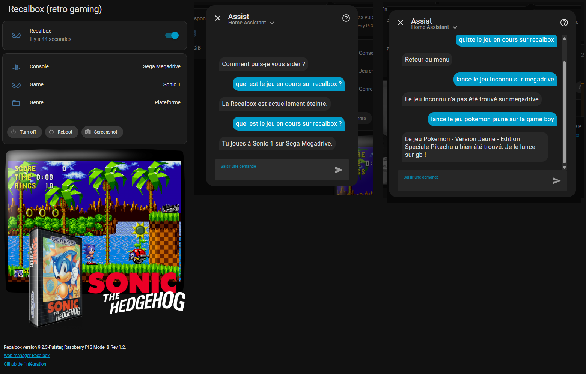
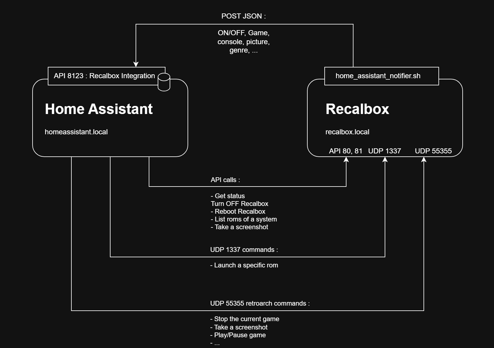
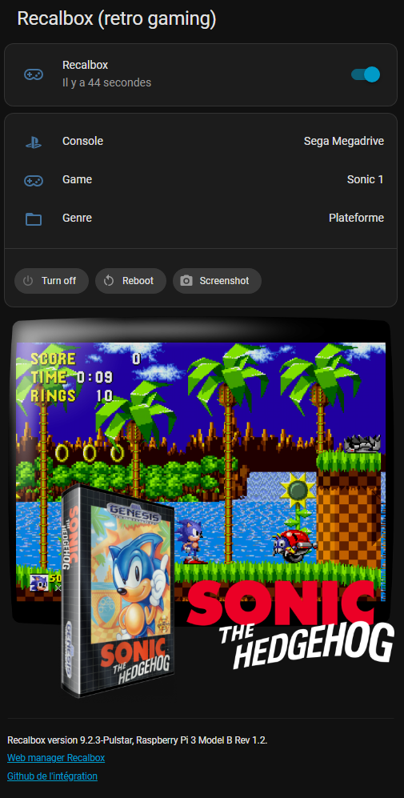
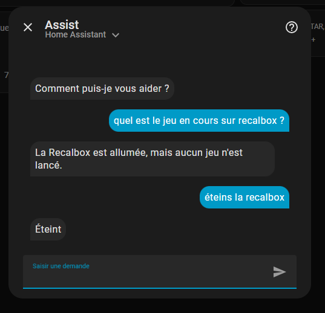
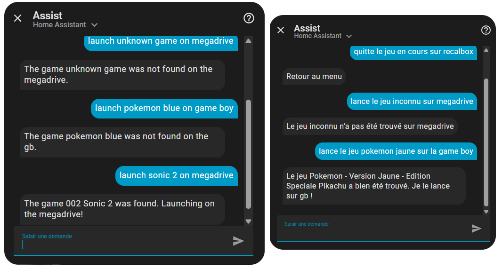

# Recalbox Home Assistant integration

By Aurélien Tomassini, 2026.



<!-- Use "markdown-toc -i README.md --maxdepth 4" to auto update table of content -->
<!-- (if not installed yet, run "npm install --save markdown-toc -g") -->

<!-- toc -->

- [Requirements](#requirements)
- [Architecture](#architecture)
- [Installation](#installation)
- [Usage](#usage)
  * [Dashboard card](#dashboard-card)
  * [Automations](#automations)
  * [Assist (text/voice)](#assist-textvoice)
    + [Turn OFF recalbox](#turn-off-recalbox)
    + [Get current game](#get-current-game)
    + [Launch a game](#launch-a-game)
    + [Stop running a game](#stop-running-a-game)
    + [Take a screenshot](#take-a-screenshot)
- [Todo](#todo)
- [Releases notes](#releases-notes)
  * [v0.0.2 - 20/01/2026](#v002---20012026)
  * [v0.0.1 - 13/01/2026](#v001---13012026)

<!-- tocstop -->

## Requirements

- You should have a `Recalbox` OS available.
  Tested only with Recalbox <mark>9.2.3</mark>, Raspberry Pi 3 B+.
  By default, should be accessible on `recalbox.local`

- You should have a `Home Assistant`.
  Tested on Home Assistant <mark>2026.1</mark>, Raspberry Pi 3 B+.
  By default, It should be accessible in the same network, at `homeassistant.local`


## Architecture



On the Recalbox, a script listens on local events, based on [Scripts sur événements d'EmulationStation | Recalbox Wiki](https://wiki.recalbox.com/fr/advanced-usage/scripts-on-emulationstation-events) .
The scripts reads the needed data for game information, and sends a MQTT message to Home Assistant with JSON data.
Home Assistant can then update its "Recalbox" entity with the current game.

The attributes read by Home Assistant are, through this JSON :
- `game `: name of the running game, user friendly. null if no game launched.
- `console `: name of the console, user friendly. null if no game launched, or "Kodi"
- `rom `: path to the current rom. null if no game launched.
- `genre `: genre of the running game, user friendly. null if no game launched.
- `genreId `: genreId of the running game. null if no game launched. Can be useful for automation where you want to set lights colors depending on type of game for example.
- `imageUrl `: URL to the image of the current game. null if no game running. The picture exists only if the game has been scrapped.
- `recalboxVersion` : Version of the Recalbox OS
- `hardware` : Device running the Recalbox

On Home Assistant, some buttons can also be used to stop/reboot/take a screenshot of the Recalbox.
It uses API ou UDP commands.

Assist integration for voice/text control has also been implemented in order to control, get information, or find a game to launch.


## Installation

1. **Recalbox**
   
   - Copy the file `Recalbox/userscripts/home_assistant_notifier.sh` in the `userscripts` Recalbox folder.
     This script will react to Recalbox events.


2. **Home Assistant**
   
   - Create a new Home Assistant User, named "recalbox" (or something else), allowed to connect only on the local network. This user will be used for MQTT Authentication. Replace the user/password `home_assistant_notifier.sh` line 13 and 14 (`MQTT_USER` & `MQTT_PASS`)
   
   - Install MQTT Mosquitto broker in Home assistant (in addons). Enable the Run on start, and watchdog.
   
   - In services integration, add MQTT service which should be now available.
     Click on reconfigure, and use the credentials defined for authentication.
	 Double check they are the same defined in `home_assistant_notifier.sh` lines 13+14.
   
   - Copy file `/packages/recalbox.yaml` from this repo, to `/homeassistant/packages/recalbox.yaml`, and add in `configuration.yaml` those lines in order to load this external config file (and then restart HA) :
     
     ```
     homeassistant:
         packages: !include_dir_named packages
     ```


## Usage 

### Dashboard card

You can add a card to your Home Assistant dashboard, in order to display the Recalbox status, game info, picture, etc.  
It will be refreshed in real time.  
You can use [recalbox_card.yaml](Home%20Assistant/dashboards/recalbox_card.yaml) to get this example :  


Three action buttons allow you to turn off, reboot, or take a screen short of the Recolbox with their web manager API.
If one of the services doesn't work as expected (like screenshot on Raspberry Pi 3 on Recalbox 9.2.3) try directly with the web manager.


### Automations

You can also create automations, triggered when a game is launched for example.  
If interested in this example, copy [recalbox_automations.yaml](Home%20Assistant/automations/recalbox_automations.yaml) into `/config/automations/recalbox_automations.yaml`
and then add
```yaml
automation: !include automations.yaml
automation yaml: !include_dir_merge_list automations/
```
in `configuration.yaml`, to allow Home Assistant to read yaml files in `automations` subfolder.


### Assist (text/voice)

The file [custom_sentences/fr/recalbox_intent.yaml](Home%20Assistant/custom_sentences/fr/recalbox_intent.yaml) and/or [custom_sentences/en/recalbox_intent.yaml](Home%20Assistant/custom_sentences/fr/recalbox_intent.yaml) should be 
copied to `/config/custom_sentences/<language>/recalbox_intent.yaml`. Update/improve the sentences according to your preferences.


#### Turn OFF recalbox

Since January 11th 2026, the script added a switch template.  
It allows to control the Recalbox as a switch, and use assist to turn OFF recalbox with voice or assist text :  
Example : 
  - "Eteins Recalbox" will turn off the Recalbox.




#### Get current game

This requires the `RecalboxGameStatus` intent in `/config/custom_sentences/<language>/recalbox_intent.yaml`.

Examples :
  - "quel est le jeu en cours [sur recalbox]"
  - "à quoi je joue [sur recalbox]"
  - "qu'est-ce qui tourne sur la recalbox"
  - "quel jeu est lancé [sur recalbox]"
  - "quel est le jeu lancé [sur recalbox]"


#### Launch a game

This requires the `RecalboxLaunchGame` intent in `/config/custom_sentences/<language>/recalbox_intent.yaml`.

Examples :
  - "Recalbox lance Pokemon Jaune sur Game Boy"
  - "Recalbox lance Mario 64 sur nintendo 64"
  - "Joue à Mario 64 sur la Nintendo 64 sur Recalbox"
  - "Lance Mario 64 sur la Nintendo 64"
  - "Lance Sonic 1 sur megadrive"

  
  
> If needed, update the systems list in `/config/custom_sentences/fr/recalbox_intent.yaml` with the consoles you want to support/recognize in the launch command.  
> By default, it supports systems recognition for launching command on NES, SNES, Megadrive, PSX, N64, GB, GBA, GBC, Dreamcast, PSP.
> 
> The search ignores case, and can find roms with words in between your search.
> Example : Searching for "Pokemon Jaune", can find the rom "Pokemon - Version Jaune - Edition Speciale Pikachu".


#### Stop the current game

> This uses a retroarch UDP command.  
> It requires to set `network_cmd_enable = true` in `retroarch.cfg`, as [documented in the Recalbox Wiki / GPIO](https://wiki.recalbox.com/en/tutorials/network/send-commands-to-emulators-with-gpio).
> Please double check the port configured in your device. This versions uses port 55355 for retroarch UDP commands.

This requires the `RecalboxStopGame` intent in `/config/custom_sentences/<language>/recalbox_intent.yaml`.

Examples :
  - "Arrête le jeu en cours sur Recalbox"


#### Take a screenshot

This requires the `RecalboxCreateScreenshot` intent in `/config/custom_sentences/<language>/recalbox_intent.yaml`.

You can make a game screenshot, simply pushing the screenshot button on your dashboard.  
You can also make a screenshot via Assist, typing or saying "Prends une capture d'écran du jeu", for example.

> Note : on Recalbox 9.2.3 or Raspberry Pi 3, the screenshots are broken, also in the Recalbox Web Manager. Hopefully it will be fixed soon.
> `fbgrab` command gives better results, but keeps the welcome screen as fixed image, to I can't switch to this command to get better screenshots.


## Todo

- [ ] Internationalization
- [ ] Screenshots : switch from API usage to retroarch, to see if it gets better results on RPI3B+


## Releases notes

### v0.0.3 - Work in progress...

- ...


### v0.0.2 - 20/01/2026

- Update the example dashboard template, to use the device information to display it at the bottom of the Recalbox column
- Moved variables to be changed on top of the `recalbox.yaml` file. The version and hardware are not hardcoded anymore.
- Adds web links to recalbox web manager, and to this repository to get updates
- Try to search for a game even if the recalbox is not seen connected
- Add `recalboxVersion` and `hardware` in the MQTT message sent to Home Assistant. So HA can know the OS version and device of Recalbox.
- Update the recalbox_card example with actual Recabox version and hardware
- Recalbox now sends messages to MQTT in retain mode for the attributes (and then remember the recabox version and hardware)
- Add 2 sensors sensor.recalbox_hardware and sensor.recalbox_firmware_version to persist values
- Add screen shot button
- Add screen shot action via assist (text or voice)
- Launch game from text/voice command, searching for the ROM in the wanted system, and launch command via UDP


### v0.0.1 - 13/01/2026

> First integration

- Hardcoded device as a Recalbox 9.2.3 on Raspberry Pi 3 (no effect, only for display). It can be changed with the yaml
- Script on Recalbox side to notify the Home Assistant of any event, and compute the game image URL
- Home Assistant package configuration complete for receiving Recalbox events, actions to turn off or reboot the recabox, dashboard template, voice/text actions to :
	- know the status of Recalbox (on/off)
	- know the currently played game
	- try to launch a game (not yet working, for know it can search if the file exists, but there is no API to laucnhe the game, and no SSH implementation done yet)