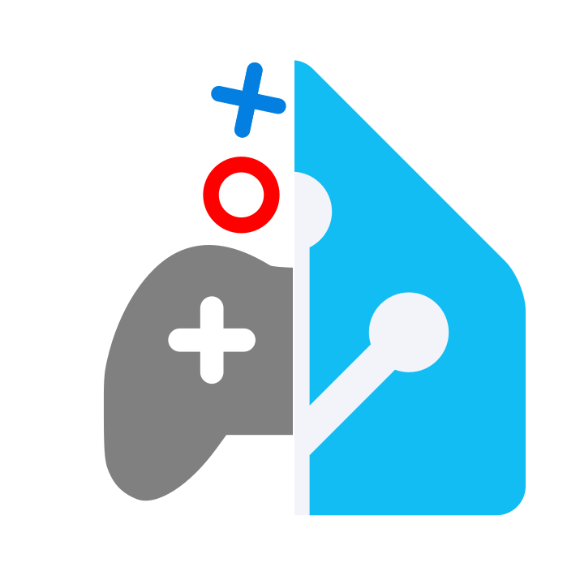

# Recalbox Home Assistant integration

<small>By Aurélien Tomassini, 2026</small>

🇺🇸 English version  
[🇫🇷 Ouvrir la version Française](README_fr.md)



This repository allows you to integrate Recalbox in your Home Assistant :
- In your dashboard :
  - Get status
  - Display current game
  - Stop current game
  - Take a screenshot
  - Pause/resume game
  - Save/Load game state
  - Turn off
  - Reboot
  - etc
- Trigger any automation you want.  
  For example, change light color according to the game launched, send notifications, etc.
- Voice/text commands with assistant (EN/FR) :
  - Launch a game by its title (full or partial title search)
  - Ask what is the current game
  - Stop current game
  - Take a screenshot
  - Pause/resume game
  - Save/Load game state
  - Turn off Recalbox
  - etc


<!-- Use "markdown-toc -i README.md --maxdepth 4" to auto update table of content -->
<!-- (if not installed yet, run "npm install --save markdown-toc -g") -->

<!-- toc -->

- [Requirements](#requirements)
- [Architecture](#architecture)
  * [Recalbox to Home Assistant](#recalbox-to-home-assistant)
  * [Home Assistant to Recalbox](#home-assistant-to-recalbox)
- [Installation](#installation)
- [Usage](#usage)
  * [Dashboard card](#dashboard-card)
  * [Automations](#automations)
  * [Assist (text/voice)](#assist-textvoice)
    + [Get current game](#get-current-game)
    + [Launch a game](#launch-a-game)
    + [Stop the current game](#stop-the-current-game)
    + [Pause/Resume the current game](#pauseresume-the-current-game)
    + [Take a screenshot](#take-a-screenshot)
    + [Save current game state](#save-current-game-state)
    + [Load last game state](#load-last-game-state)
    + [Turn OFF recalbox](#turn-off-recalbox)
    + [Quit Kodi](#quit-kodi)
- [Releases notes](#releases-notes)
- [Troubleshot](#troubleshot)
  * [`CRLF` / `LF` run script issue](#crlf--lf-run-script-issue)
  * [IP v6](#ip-v6)

<!-- tocstop -->

## Requirements

- You should have a `Recalbox` available.  
  Tested only with Recalbox <mark>9.2.3</mark>, Raspberry Pi 3 B+.  
  Should be accessible by its hostname, like `recalbox.local` for example.  
  > Its API ports (80 and 81) and UDP ports (1337 and 55355) should be accessible in the local network (enabled by default).


- You should have a `Home Assistant`.  
  Tested on Home Assistant <mark>2026.1</mark>, Raspberry Pi 3 B+.  
  By default, It should be accessible in the same network, at `homeassistant.local`


## Architecture


### Recalbox to Home Assistant

On the Recalbox, a script listens on local events, based on [Scripts sur événements d'EmulationStation | Recalbox Wiki](https://wiki.recalbox.com/fr/advanced-usage/scripts-on-emulationstation-events) .
The scripts reads the needed data for game information, and sends a message to Home Assistant with JSON data.
Home Assistant can then update its "Recalbox" entity with the current game.

> The attributes read by Home Assistant are, through this JSON :
> - `game`
> - `console`
> - `rom`
> - `genre`
> - `genreId`
> - `imageUrl`
> - `recalboxIpAddress`
> - `recalboxVersion` : Version of the Recalbox OS
> - `hardware` : Device running the Recalbox
> - `scriptVersion` : Version of the integration script in the Recalbox


### Home Assistant to Recalbox

On Home Assistant, orders are sent to Recalbox via API and UDP commands :
- Stop, reboot, screenshot commands via API
- Game list via API
- Launch a game via UDP

Assist integration for voice/text control has also been implemented in order to
control, get information, or find a game to launch.  
It uses the same services just listed.


## Installation

1. **Recalbox**
   
   - Copy the script `Recalbox/userscripts/home_assistant_notifier.sh` in the `userscripts` Recalbox folder. Optimized since v1.3.1.
     
     > If your Home Assistant is not accessible via `homeassistant.local`,
       change the "HOME_ASSISTANT_DOMAIN" variable on top of the script.


2. **Home Assistant**
   
   - If not installed yet, [install HACS](https://www.hacs.xyz/docs/use/download/download/)
   
   - Install this repository via this button :  
     [](https://my.home-assistant.io/redirect/hacs_repository/?owner=ooree23&repository=RecalboxHomeAssistant&category=integration)  
     > Or manually, add `https://github.com/ooree23/RecalboxHomeAssistant` as repository, as Integration.
       Press download, and then accept to restart.
     
     It will automatically add Recalbox integration to your Home Assistant
     (new "Recalbox" Integration will be available after restart in the Devices & Service menu).
    
   - Add your new Recalbox with this button  
     [](https://my.home-assistant.io/redirect/config_flow_start/?domain=recalbox)  
     > Or, manually, go to Devices & Services menu, "+ add integration", and search for "Recalbox".  
     
     You will be asked for Host/IP of your Recalbox (the default host is "recalbox.local"), and ports can be changed if needed.
     If you can, have your Recalbox ON, and then let the "Test connection" checkbox checked to test host and ports.  
     
     > You can use as many Recalbox as you want in your Network.  
       Depending on the infrastructure, if you have dynamic IP address, please use Hostnames,
       not IP address, as it could change later.
       
      


## Usage 


> Most of in-game button/voice actions use UDP commands.  
> If not working, ensure that your Recalbox has `network_cmd_enable = true` in `retroarch.cfg`, as [documented in the Recalbox Wiki / GPIO](https://wiki.recalbox.com/en/tutorials/network/send-commands-to-emulators-with-gpio).  
> This versions uses port 55355 for retroarch UDP commands by default.


### Dashboard card

You can add a Recalbox card to your Home Assistant dashboard, in order to display the Recalbox status, game info, picture, etc.  
It will be refreshed in real time.

Go to your dashboard in edit mode, "+ add card", scroll down to Custom Cards : "Recalbox Card".  
Since v1.3.0, a UI have been implemented for visual edition of the card options, with live preview :


Both visual editor, and the card view, are translated in English and French, depending on your user language.  
Once configured, you'll get your card with the options you selected.  
Example : all buttons shown, update alert shown, genre shown, but Rom path hidden :


### Automations

You can also create automations, triggered when a game is launched for example.  
If interested in this example, copy [recalbox_automations.yaml](Home%20Assistant/automations/recalbox_automations.yaml) into `/config/automations/recalbox_automations.yaml`
and then add
```yaml
automation: !include automations.yaml
automation yaml: !include_dir_merge_list automations/
```
in `configuration.yaml`, to allow Home Assistant to read yaml files in `automations` subfolder.


### Assist (text/voice)

> Since v0.2.0, a script auto installs the sentences and sentences updates.
> Check the dashboard custom card to see if the HA needs a restarts to update the sentences.


#### Get current game

Examples :
  - "What's the current game on Recalbox?"
  - "Which game is running on the Recalbox?"
  - "Quel est le jeu en cours [sur recalbox]"
  - "A quoi je joue [sur recalbox]"
  - "Qu'est-ce qui tourne sur la recalbox"
  - "Quel jeu est lancé [sur recalbox]"
  - "Quel est le jeu lancé [sur recalbox]"


#### Launch a game

Examples :
  - "Launch Sonic 3 on megadrive"
  - "Run Final Fantasy on Playstation"
  - "Start Mario on Nintendo 64 on Recalbox"
  - "Play Mario on Nintendo 64 on Recalbox"
  - "Recalbox lance Pokemon Jaune sur Game Boy"
  - "Recalbox lance Mario 64 sur nintendo 64"
  - "Joue à Mario 64 sur la Nintendo 64 sur Recalbox"
  - "Lance Mario 64 sur la Nintendo 64"
  - "Lance Sonic 1 sur megadrive"

  

> The search ignores case, and can find roms with words in between your search.
> Example : Searching for "Pokemon Jaune", can find the rom "Pokemon - Version Jaune - Edition Speciale Pikachu".


#### Stop the current game


Examples :
  - "Quit the current game"
  - "Stop the game on Recalbox"
  - "Arrête le jeu en cours sur Recalbox"


#### Pause/Resume the current game


Examples :
  - "Pause the current game"
  - "Resume the game on Recalbox"
  - "Mets le jeu en pause"


#### Take a screenshot

You can make a game screenshot, simply pushing the screenshot button on your dashboard.  
You can also make a screenshot via Assist. 

Examples :
  - "Take a screenshot of the game"
  - "Make a game screen shot"
  - "Prends une capture d'écran du jeu"
  - "Fais un screenshot du jeu"

> We try doing the screenshot in two ways :
> - trying first a UDP command screenshot, which is more integrated
> - if fails because of wrong port, then it tries using API.  
>   Note about API : on Recalbox 9.2.3 on Raspberry Pi 3, the screenshots via API are broken (also in the Recalbox Web Manager). That's why I chose UDP first.


#### Save current game state

Examples :
- "Save the current game"
- "Save my game state on Recalbox"
- "Enregistre la partie en cours"
- "Enregistre mon jeu"
- "Sauvegarde ma partie"


#### Load last game state

Examples :
- "Load my last game state"
- "Load the last save"
- "Recharge ma sauvegarde du jeu"
- "Recharge la dernière partie"


#### Turn OFF recalbox

> This uses the Home Assistant intent to turn OFF the Recalbox, recognized as a switch.
> Please ensure that you give an easy name of your Recalbox Entity, to help
> Home Assistant Assist to recognize the device you want to turn OFF.

Examples :
- "Turn off Recalbox"
- "Eteins Recalbox"


#### Quit Kodi

> This uses port 8081 by default. It only works if Kodi is currently running.

Examples :
- "Quit Kodi"
- "Exit Kodi"


## Releases notes

See [change logs file](CHANGELOG.md)


## Troubleshot

### `CRLF` / `LF` run script issue 

If your Recalbox doesn't seem to reach Home Assistant, while you have your script in `userscripts`,
please make sure the `.sh` file is using "LF" line separator :
- You can run via SSH `sh <path-to-the-script>` :  
  if there are errors saying "\r" is invalid, it means
  your sh file line separators have been modified, while it must not.
- Or you can simply open the `.sh` file in a compatible editor, like your IDE, or Notepad++,
  and check on the bottom right corner if it is shown `CRLF` (wrong) or `LF` (good).  

If you downloaded the file with git on windows, the line separator could have been automatically 
changed to CRLF, while Recalbox script only accepts LF.
In that case, type `git config --global core.autocrlf input` in command line, to make sure that 
git keeps the "LF" as it was in the file, without changing it.

Also, make sure that you are using the latest script version.
If your script version is too old, a message will be shown in your Recalbox Card.


### IP v6

When your Home Assistants resolves the hostname of your Recalbox, it can use IPv6.
It seems to have some troubles (at least on RPi3), so Recalbox doesn't receive the requests from Home Assistant.
A toast is shown in Home Assistant showing an IPv6 address.

If it occures too often, go to your integration settings, and change your hostname to the IP address v4.
It will fix this issue, but if your router changes your IP address, you will have to change it again.

> Version v1.5.0 forces now to use IPv4.  
> This issue should not happen again. If it does again, disable IPV6 in Home Assistant (Settings, Network, IPv6, disable)