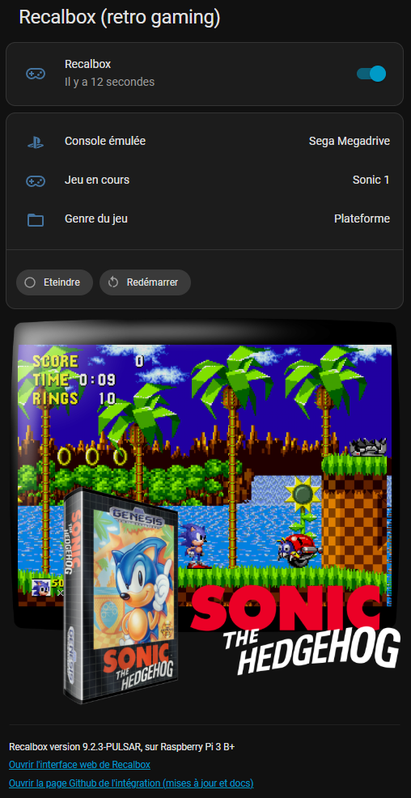
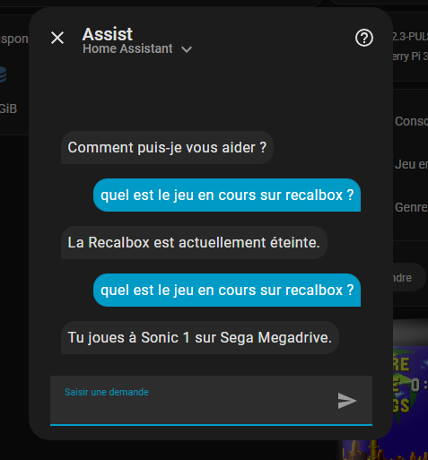
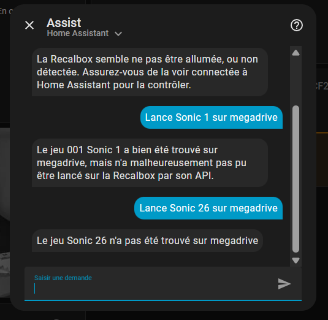

# Recalbox Home Assistant integration

By Aurélien Tomassini, 2026.



## Features

A script listens on Recalbox events, based on [Scripts sur événements d'EmulationStation | Recalbox Wiki](https://wiki.recalbox.com/fr/advanced-usage/scripts-on-emulationstation-events) . The scripts reads the needed data for game information, and sends a MQTT message to Home Assistant with JSON data. Home Assistant can then update its "Recalbox" entity with the current game.

The attributes read by Home Assistant are, through this JSON :

- `game `: name of the running game, user friendly. null if no game launched.

- `console `: name of the console, user friendly. null if no game launched, or "Kodi"

- `rom `: path to the current rom. null if no game launched.

- `genre `: genre of the running game, user friendly. null if no game launched.

- `genreId `: genreId of the running game. null if no game launched. Can be useful for automation where you want to set lights colors depending on type of game for example.

- `imageUrl `: URL to the image of the current game. null if no game running. The picture exists only if the game has been scrapped.

Two buttons can also be used to stop/reboot the recalbox via Home Assistant.

## Context

- You should have a `Recabox `OS available.
  Tested only with Recalbox <mark>9.2.3</mark>, Raspberry Pi 3 B+.
  By default, should be accessible on `recalbox.local`

- You should have a `Home Assistant`.
  Tested on Home Assistant <mark>2026.1</mark>.
  By default, It should be accessible in the same network, at`homeassistant.local`

## Installation

1. **Recalbox**
   
   - Copy the file `Recalbox/userscripts/home_assistant_notifier.sh` in the `userscripts` Recalbox folder.
     This script will react to Recabox events :
     
     - `start`|`systembrowsing`|`endgame `: refreshes the status ON, no game
     
     - `runkodi `: refreshes ON status, set the current console as "Kodi"
     
     - `rungame `: refreshes ON status, show current game, console (readable name), and builds image URL base on the scrapped data. If the game has a numeric prefix with 3 digits, it is removed. Example : "001 Sonic 1" will be shown as "Sonic 1".
     
     - `stop `: change status to OFF, remove current game, image

2. **Home Assistant**
   
   - Create a new Home Assistant User, named "recalbox" (or something else), allowed to connect only on the local network. This user will be used for MQTT Authentication. Replace the user/password `home_assistant_notifier.sh` line 13 and 14 (`MQTT_USER` & `MQTT_PASS`)
   
   - Install MQTT Mosquitto broker in Home assistant (in addons). Enable the Run on start, and watchdog.
   
   - In services integration, add MQTT service which should be now available.
     Click on reconfigure, and use the credentials defined for authentication.
	 Double check they are the same defined in `home_assistant_notifier.sh` lines 13+14.
   
   - Copy file `/packages/recalbox.yaml` from this repo, to `/homeassistant/packages/recalbox.yaml`, and add in `configuration.yaml` those lines in order to load this external config file (and then restart HA) :
     
     ```
     homeassistant:
         packages: !include_dir_named packages
     ```
 
## Usage 

### Add Recalbox status to dashboard
 
Add a card to Home Assistant to display the Recalbox status, game info, picture, etc. 
It will be refreshed in real time.

For example :

 
```yaml
type: vertical-stack
title: Recalbox (retro gaming)
cards:
  - type: entities
    entities:
      - entity: switch.recalbox_global
        icon: mdi:gamepad-variant-outline
        secondary_info: last-changed
  - type: markdown
    content: |-
      <small>Version 9.2.3-PULSTAR,
      sur Raspberry Pi 3B+
      </small>
  - type: entities
    visibility:
      - condition: state
        entity: binary_sensor.recalbox_rpi3
        state: "on"
    entities:
      - type: attribute
        entity: binary_sensor.recalbox_rpi3
        attribute: console
        name: Console émulée
        icon: mdi:sony-playstation
      - type: attribute
        entity: binary_sensor.recalbox_rpi3
        attribute: game
        name: Jeu en cours
        icon: mdi:gamepad-variant-outline
      - type: attribute
        entity: binary_sensor.recalbox_rpi3
        attribute: genre
        name: Genre du jeu
        icon: mdi:folder-outline
    show_header_toggle: false
    state_color: false
    footer:
      type: buttons
      entities:
        - entity: button.recalbox_eteindre_recalbox
          name: Eteindre
        - entity: button.recalbox_reboot_recalbox
          name: Redémarrer
  - type: markdown
    visibility:
      - condition: state
        entity: binary_sensor.recalbox_rpi3
        state: "on"
    content: |-
      <center>
      
      </center>
    text_only: true
 ```

### Automation when a game is launched

You can also use automations based on launched games.
Example : send phone notification when a game in launched :
 
```yaml
alias: Notification de nouveau jeu
description: Annonce le nouveau jeu qui vient d'être lancé
triggers:
  - trigger: state
    entity_id:
      - binary_sensor.recalbox_rpi3
    attribute: game
conditions:
  - condition: template
    value_template: |-
      {{ trigger.to_state.attributes.game != None and 
         trigger.to_state.attributes.game != 'unknown' and
         trigger.to_state.attributes.console != 'Kodi' and
         trigger.to_state.attributes.game != '' }}
actions:
  - action: notify.notify
    metadata: {}
    data:
      message: >-
        Lancement du jeu {{ trigger.to_state.attributes.game -}}

        , sur {{
        trigger.to_state.attributes.console }}

         ({{
        trigger.to_state.attributes.genre }}).
      title: Jeu sur Recalbox
mode: single
```

### Turn OFF recalbox with text/voice command

Since January 11th 2026, the script added a switch template.
It allows to control the Recalbox as a switch, and use assist to turn OFF recalbox with voice or assist text :

Example : "Eteins Recalbox" will turn off the Recalbox.


### Get current game with text/voice command

- Create file `/config/custom_sentences/<language>/recalbox_intent.yaml`, with `RecalboxGameStatus` intent.
Example in `custom_sentences/fr/recalbox_intent.yaml` :

```yaml
language: "fr"
intents:
  RecalboxGameStatus:
    data:
      - sentences:
          - "quel est le jeu en cours [sur recalbox]"
          - "à quoi je joue [sur recalbox]"
          - "qu'est-ce qui tourne sur la recalbox"
          - "quel jeu est lancé [sur recalbox]"
          - "quel est le jeu lancé [sur recalbox]"
```




### Select a game with assistant

> NOTE : on January 12th, with Recalbox 9.2.3, I didnt find an uptodate API to launch a game.
> The one I had need to be updated, because not working :
> > recalbox_launch_game:
> > url: "http://recalbox.local:81/api/systems/{{ console }}/launcher"
> > method: POST
> > payload: "{{ path }}"
> > content_type: "text/plain"

- Copy/get the intent RecalboxLaunchGame for game launch in `custom_sentences/fr/recalbox_intent.yaml` :
```yaml
language: "fr"
intents:
  (...)
  RecalboxLaunchGame:
    data:
      - sentences:
          - "joue à {game} sur [la] {console} sur recalbox"
          - "lance {game} sur [la] {console}"
          - "recalbox lance {game} sur [la] {console}"
```

- Update the systems list in `/config/custom_sentences/fr/recalbox_intent.yaml` with the consoles you want to support in the launch command.
  By default, it supports launching command on NES, SNES, Megadrive, PSX, N64, GB, GBA, GBC, Dreamcast, PSP.
  
  The search ignores case, and can find roms with words in between your search.
  Example : Searching for "Pokemon Jaune", can find the rom "Pokemon - Version Jaune - Edition Speciale Pikachu".
  
  
  
  Query examples :
  - "Recalbox lance Pokemon Jaune sur Game Boy"
  - "Recalbox lance Mario 64 sur nintendo 64"
  - "Joue à Mario 64 sur la Nintendo 64 sur Recalbox"
  - "Lance Mario 64 sur la Nintendo 64"
  - "Lance Sonic 1 sur megadrive"
